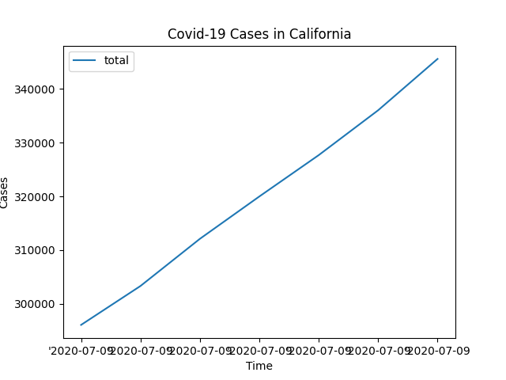

# Covid-19-Scraper

This is a project thats tracks Covid-19 Infections within the state of California and presents the information in an interactive visualization. Utilizes AWS to automatically gather data once a day.

## Installation

Use the package manager [pip](https://pip.pypa.io/en/stable/) to install all the dependencies

```bash
pip3 install requests
pip3 install DateTime
pip3 install beautifulsoup4
pip3 install pandas
pip3 install glob3
pip3 install mpld3
pip3 install matplotlib
```

##Example


## Tools
* Python3
* AWS Lambda
* AWS S3 Bucket
* AWS Identity and Access Management
* AWS CloudWatch

##Project Status
Ongoing


